# ハローワールド

## 目的
- Javaプロジェクトを作成
- コンパイルしJarファイルを生成

## 手順

### IDEダウンロード

- [Eclipse](https://mergedoc.osdn.jp/)
- [Visual Studio Code](https://code.visualstudio.com/) + [Java Extention](https://marketplace.visualstudio.com/items?itemName=vscjava.vscode-java-pack)

いずれかの開発用ソフトウェアを準備してください。

※ 以下の手順は、Eclipseで進めます。

### プロジェクト作成

1. プロジェクト追加

    1. Eclipse起動
        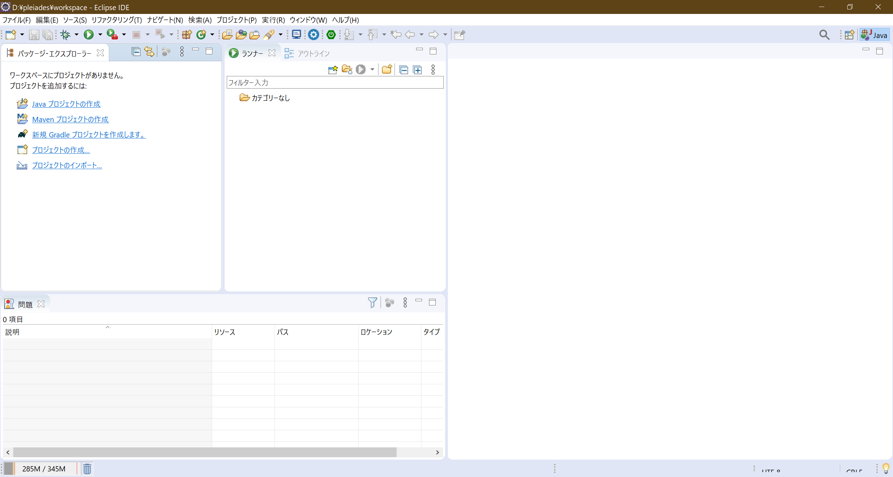
    1. ファイル->Javaプロジェクトをクリック
        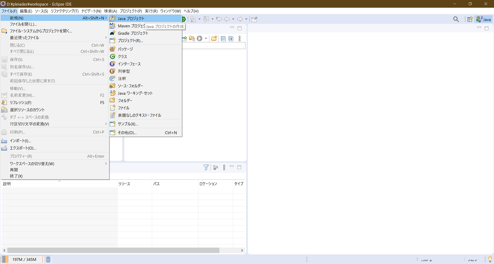
    1. 新規プロジェクト設定

        ※デフォルト値以外のものを記載
        |設定名|値|備考|
        |-----|--|--|
        |プロジェクト名|HellowWorld|※任意の名前|
        |JRE|プロジェクト固有のJREを仕様:java8|※Javaのバージョンは適時変更してください。|

        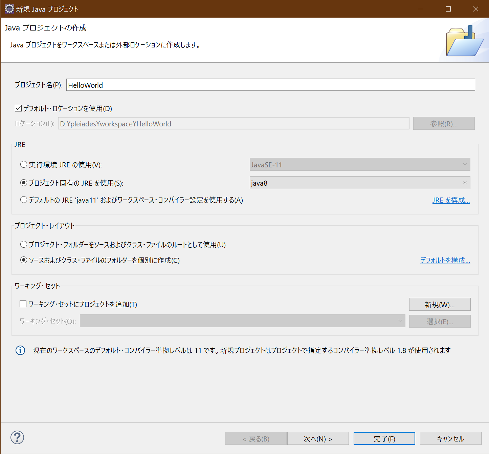

        変更しないで完了
        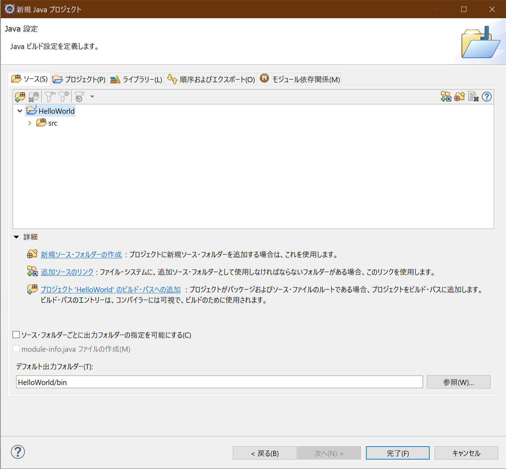

    1. プロジェクト追加結果
        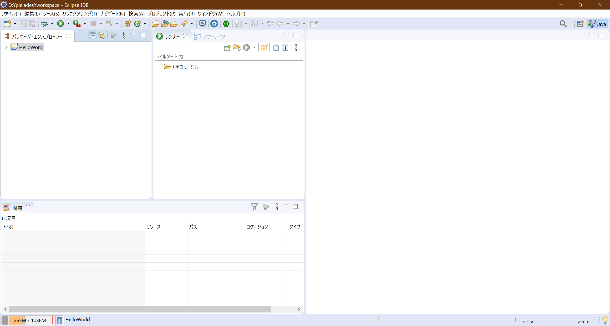

1. メインクラス作成
    1. プロジェクトを右クリック->新規->クラスを選択
        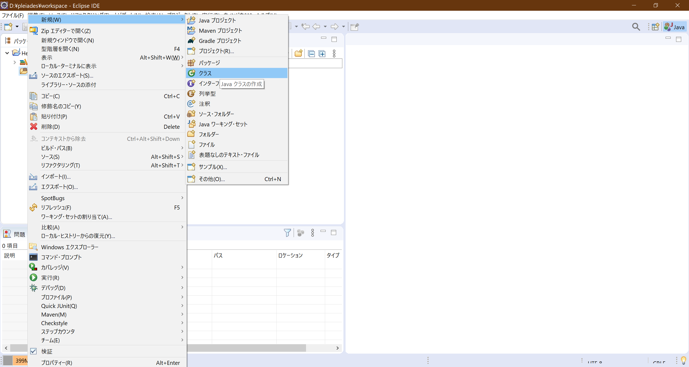

    1. 新規Javaクラス設定
        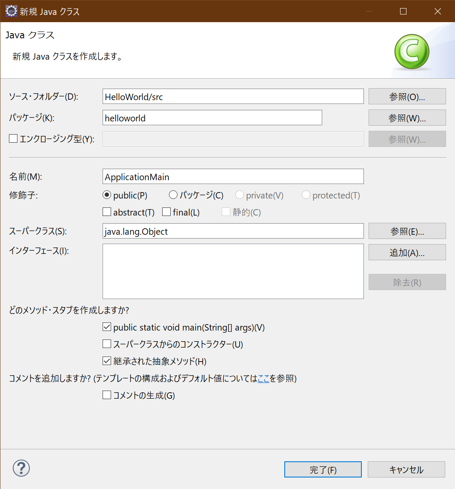

        ※デフォルト値以外のものを記載
        |設定名|値|備考|
        |-----|--|--|
        |パッケージ名|hellowworld|※任意の名前|
        |名称|ApplicationMain|※任意の名前|
        |public static void main(String[] args)(v)|チェック|プログラム起動時最初に呼び出されることになるメソッドを自動作成 ※自分で記述しても問題ありません。|
        
        追加結果
        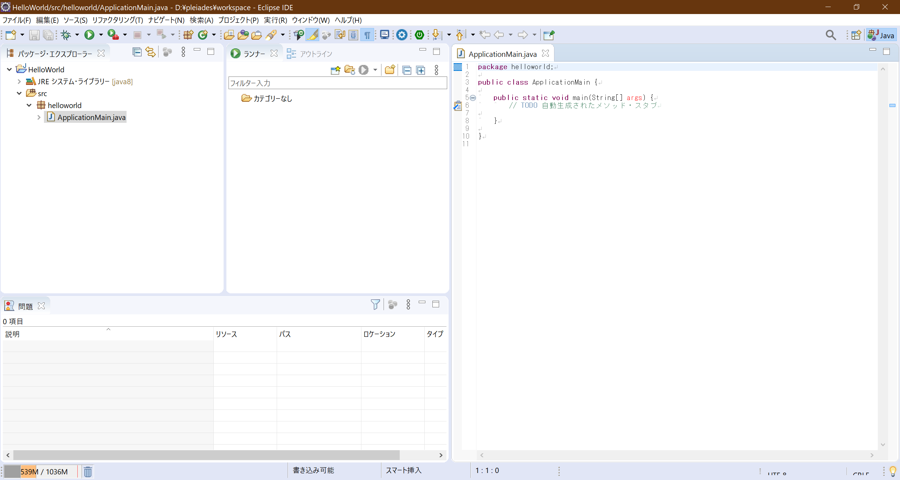

1. HellowWorld出力プログラム作成
    1. main メソッドに、標準出力にHellowWorldと出力するプログラムを追記
        ``` Java
            public static void main(String[] args) {
                //コンソール出力追加
                System.out.println("Hellow World");
            }
        ```
    1. 実行
        エディタ上で右クリックし、実行->Javaアプリケーションを選択する。
        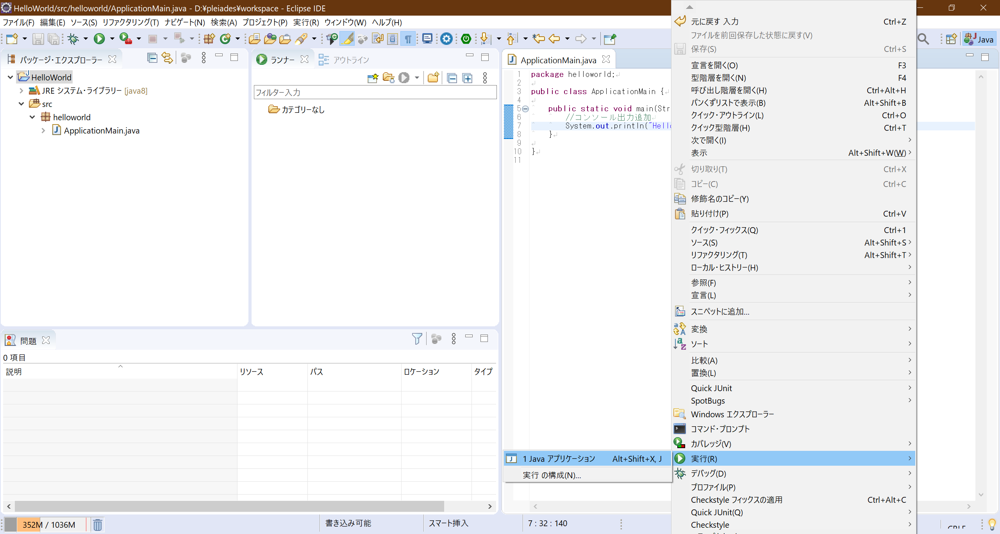

        出力結果は左下のコンソールに出力
        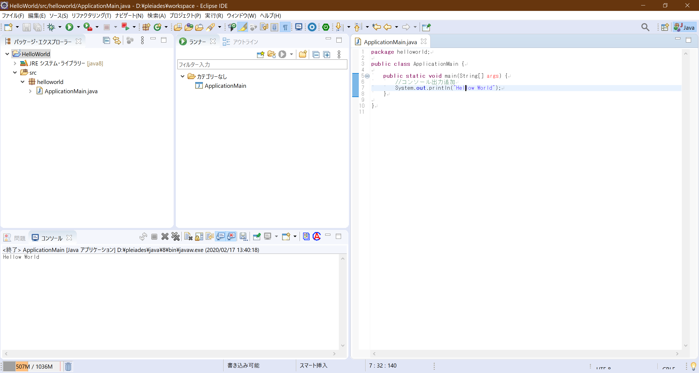

1. 実行ファイル作成
    1. プロジェクトを右クリックし、エクスポートを選択
        

    1. 実行可能Jarファイルを選択
        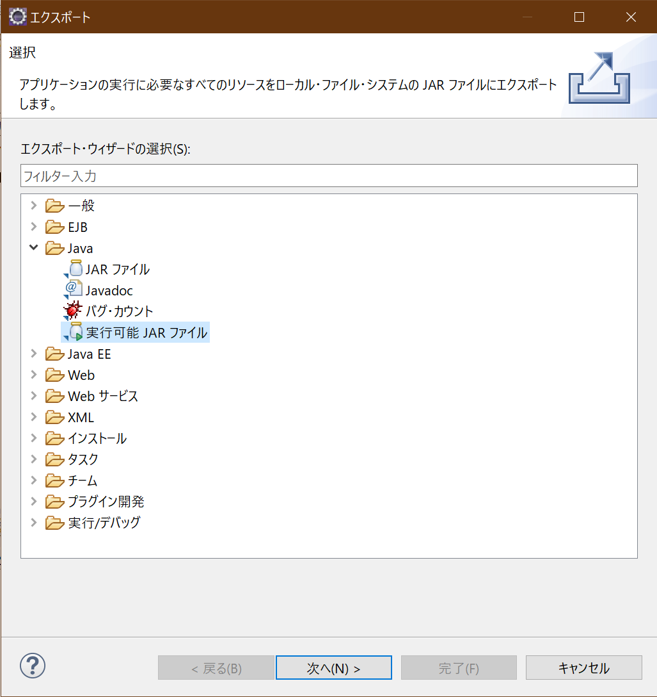

    1. 実行可能Jarファイル設定
        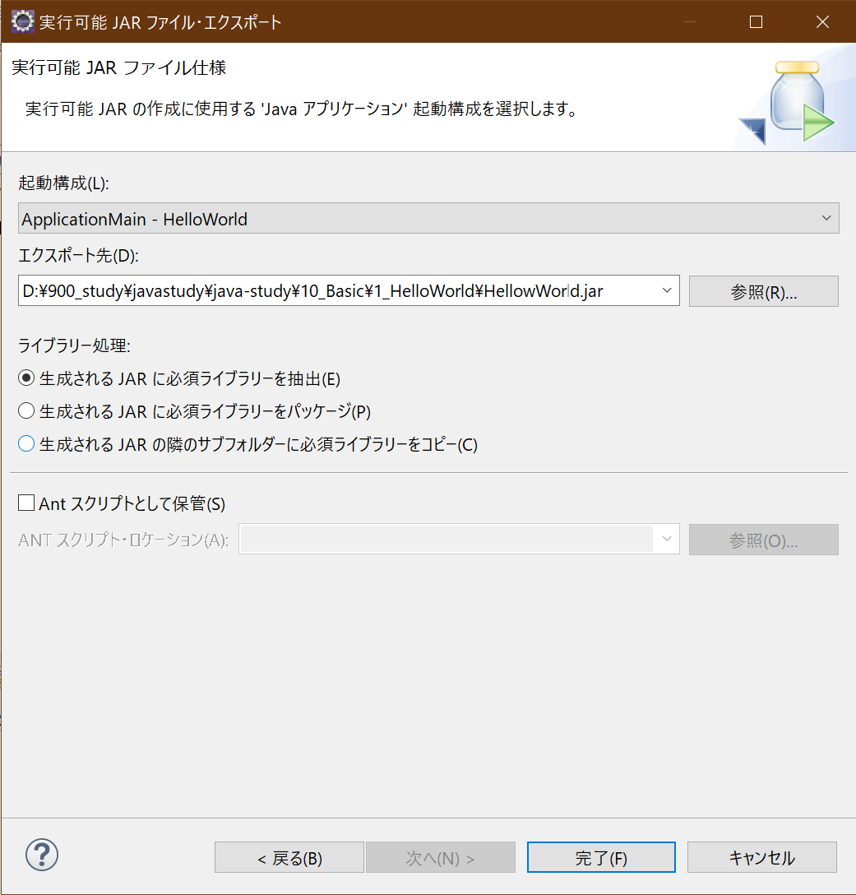
        |設定名       |値                        |備考                         |
        |------------|--------------------------|----------------------------|
        |起動構成     |ApplicationMain -HelloWorld|{メインクラス名}-{プロジェクト名}|
        |エクスポート先|※任意の出力先| |

1. Jarファイルの起動
    以下のコマンドを実行し、プログラムを起動してください。

    ```
        java -jar .\HelloWorld.jar
    ```
    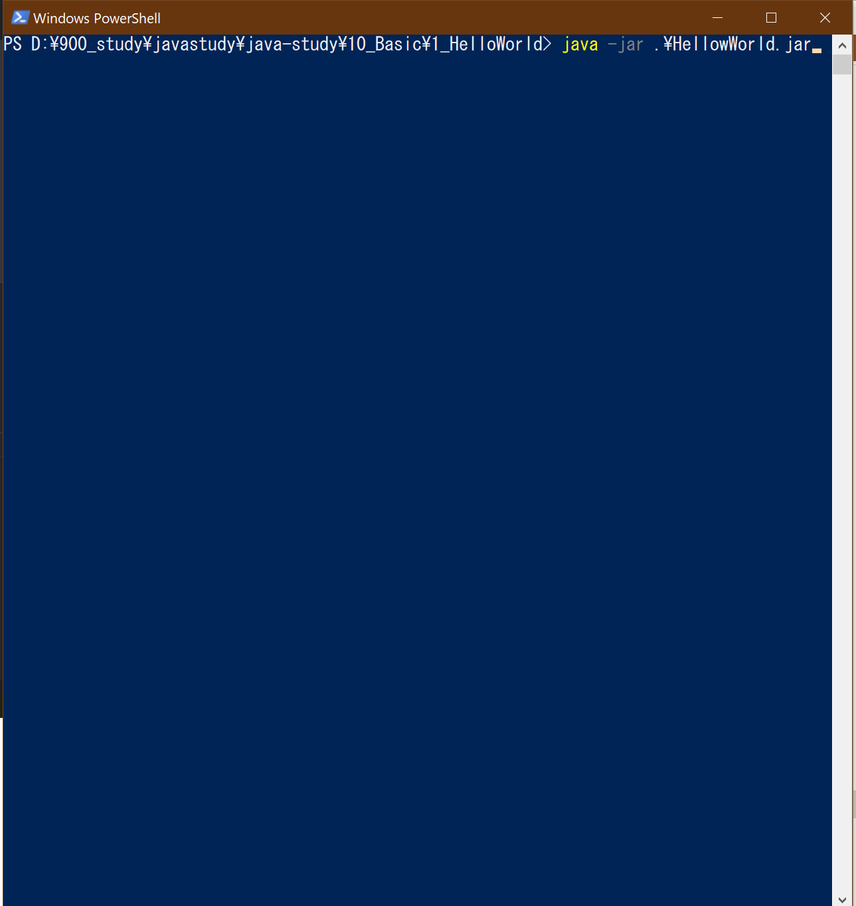

