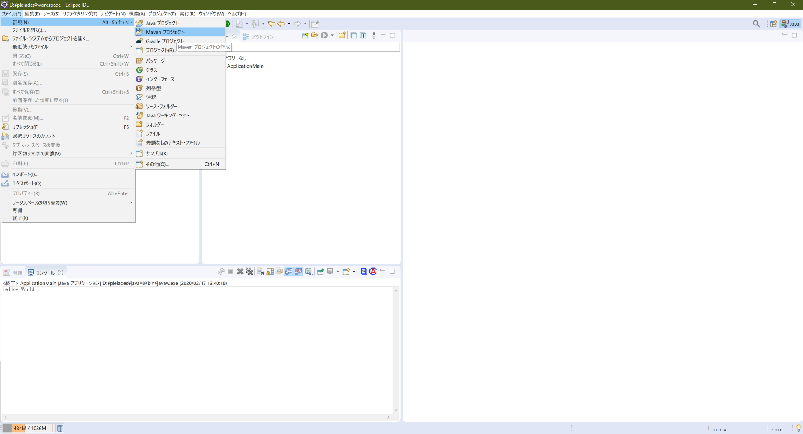
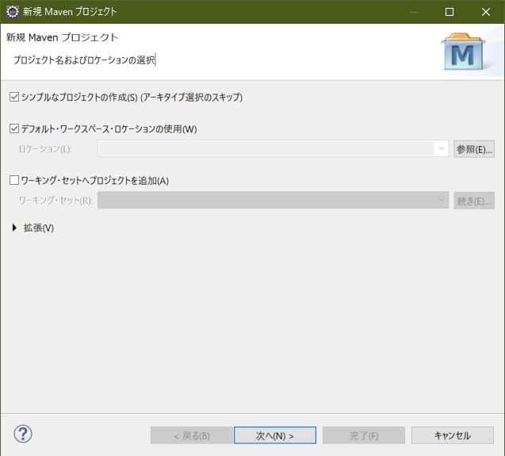
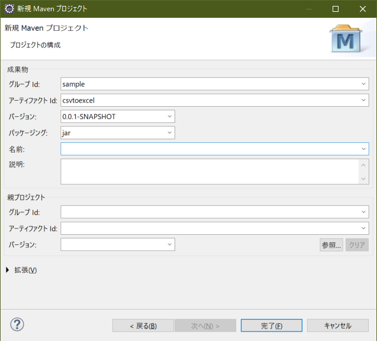
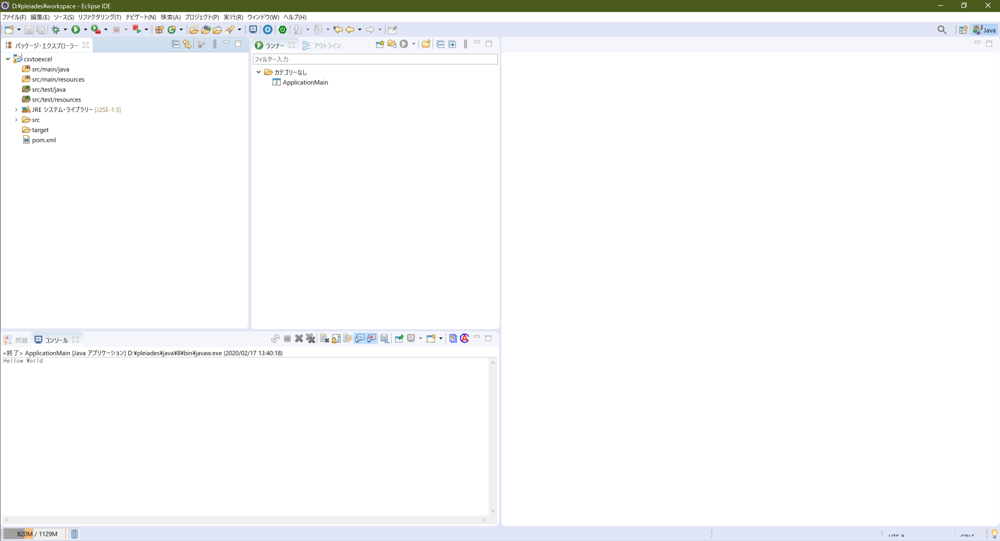
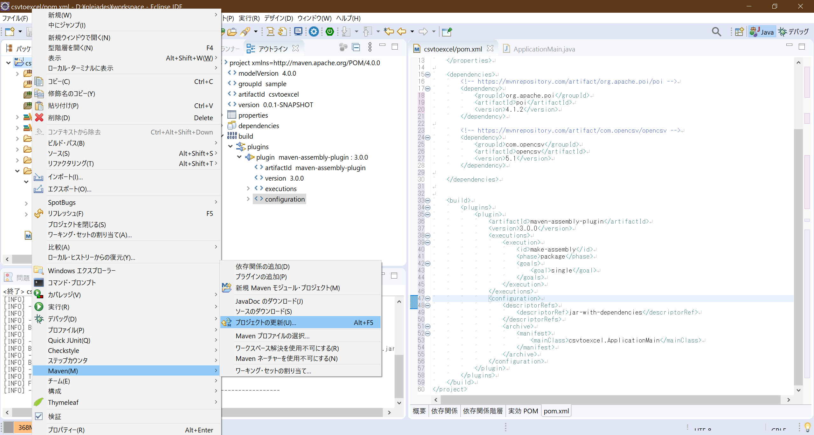
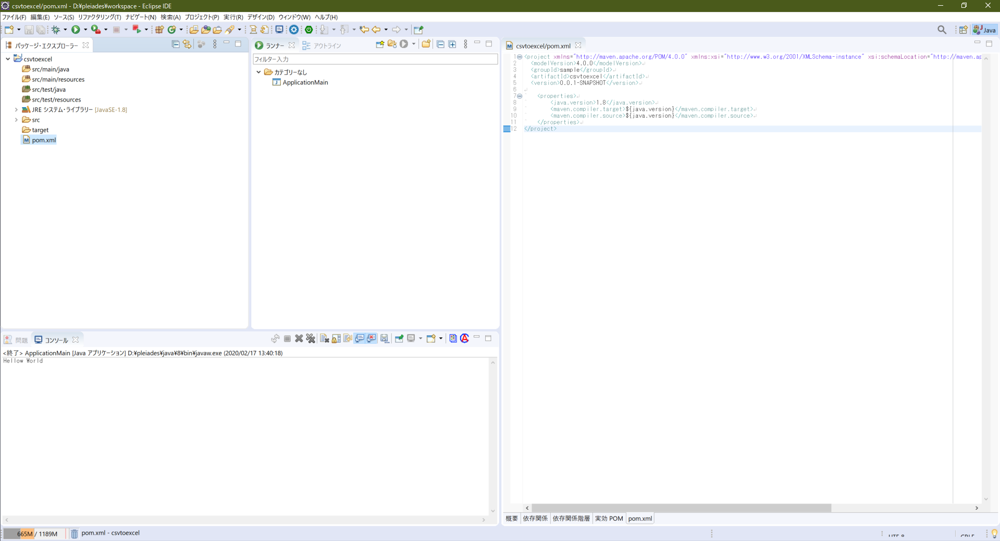

# CSVからExcelファイル変換

## 目的
- 外部ライブラリを利用してプログラムを作成

    [Maven](https://maven.apache.org/)を利用した環境構築
        
    Javaのビルドツール＋外部ライブラリ管理ツール

- コンパイルしJarファイルを生成


## 手順

1. Mavenプロジェクトを追加
    ファイル->新規→Mavenプロジェクト
    

    シンプルなプロジェクトの作成にチェックを入れ、次へ
    

    グループIDなどを入力し完了
    

    |設定名       |値                        |備考                         |
    |------------|-------------------------|----------------------------|
    |グループId    |sample                   |※任意のパッケージ名|
    |アーティファクトId|csvtoexcel            |※任意の出力先|

    関連ファイルが自動的にダウンロードされ、しばらくするとプロジェクトが追加される。
    


1. プロジェクト設定

    POM.XMLファイルを以下のように追記し、Javaのバージョンを指定する。

    ``` xml
    <project xmlns="http://maven.apache.org/POM/4.0.0" xmlns:xsi="http://www.w3.org/2001/XMLSchema-instance" xsi:schemaLocation="http://maven.apache.org/POM/4.0.0 https://maven.apache.org/xsd/maven-4.0.0.xsd">
    <modelVersion>4.0.0</modelVersion>
    <groupId>sample</groupId>
    <artifactId>csvtoexcel</artifactId>
    <version>0.0.1-SNAPSHOT</version>

        <!-- 以下、追加 -->
        <properties>
            <java.version>1.8</java.version>
            <maven.compiler.target>${java.version}</maven.compiler.target>
            <maven.compiler.source>${java.version}</maven.compiler.source>
        </properties>
    </project>
    ```

    プロジェクトを右クリックし、Maven->プロジェクトの更新をクリックする。
    
    
    正常に更新されると、JREシステムライブラリがJavaSe-1.8に変更される。
    


1. 外部ライブラリの参照を追加

    Maven Repositoryから定義を確認し、POM.XMLに追加してください。

    [Maven Repository(https://mvnrepository.com/)](https://mvnrepository.com/)


    |ライブラリ名|Version|URL|
    |----------|-------|---|
    |Apache POI |4.1.2 |https://mvnrepository.com/artifact/org.apache.poi/poi/4.1.2|
    |OpenCSV|5.1|https://mvnrepository.com/artifact/com.opencsv/opencsv/5.1|

    ※追加イメージ
    ``` xml
    <dependencies>
        <!-- https://mvnrepository.com/artifact/org.apache.poi/poi -->
        <dependency>
            <groupId>org.apache.poi</groupId>
            <artifactId>poi</artifactId>
            <version>4.1.2</version>
        </dependency>
        <!-- https://mvnrepository.com/artifact/com.opencsv/opencsv -->
        <dependency>
            <groupId>com.opencsv</groupId>
            <artifactId>opencsv</artifactId>
            <version>5.1</version>
        </dependency>
    </dependencies>
    ```


## 課題
1. プログラム作成

 
    - CSVファイル読込、Excelファイル（xls形式 または、xlsx形式)を出力
    - Excelファイル（xls形式 または、xlsx形式)を読込、CSVファイル
    
    ApachePOIの仕様確認部分（仕様が独特な為）
    - Excelファイルの計算式が入っているセルの読み取り、書き込み
    - 行追加、行削除、セル追加、セル削除等

    サンプルプログラム(CSVからExcelファイルへの変換処理)
    ```java
    package csvtoexcel;

    import java.io.BufferedOutputStream;
    import java.io.BufferedReader;
    import java.io.FileInputStream;
    import java.io.FileOutputStream;
    import java.io.InputStreamReader;
    import java.util.List;

    import org.apache.poi.hssf.usermodel.HSSFCell;
    import org.apache.poi.hssf.usermodel.HSSFRow;
    import org.apache.poi.hssf.usermodel.HSSFSheet;
    import org.apache.poi.hssf.usermodel.HSSFWorkbook;

    import com.opencsv.bean.CsvToBeanBuilder;


    public class CsvToExcel {

        /**
        * CSVファイルからExcelファイルにデータ出力(旧フォーマット)
        * @param fromPath
        * @param toPath
        * @throws Exception
        */
        public static void ExecuteXls(String fromPath,String toPath) throws Exception
        {
            //-----------------------------
            //CSVファイル読込
            //-----------------------------
            // java.util.List に CsvItem格納するための変数を定義
            List<CsvItem> list = null;


            // ファイル読取
            //-----------------------------
            // テキストファイル読込は、基本パターン
            // FileInputStream,文字コード指定->InputStreamReader->BufferedReaderにすることで、
            // 内部バッファが利用されるようになり、一度に大きなファイルを開いてしまいメモリが足りなくなることや
            // 処理速度低下を未然に防ぐ作用があります。
            //
            // また、try構文を使うことで、変数が利用されなくなると自動的にクローズされれ、
            // ファイルのデットロック等を防ぐことができます。

            try (BufferedReader reader = new BufferedReader(new InputStreamReader(new FileInputStream(fromPath), "UTF-8"))) {

                //今回はOpenCsvライブラリを利用しファイル読込を簡単に実施
                //https://qiita.com/vicugna-pacos/items/6bc9fa3269d0b8484c9c参考
                CsvToBeanBuilder<CsvItem> builder = new CsvToBeanBuilder<CsvItem>(reader);
                builder.withType(CsvItem.class);
                list = builder.build().parse();
            }


            //-----------------------------
            // CSVファイル読込
            //-----------------------------
            // Excelブックを作成 ※HSSF (旧Excelファイルフォーマット)
            try(HSSFWorkbook workbook1 = new HSSFWorkbook())
            {
                // Excel シートを作成 ※HSSF (旧Excelファイルフォーマット)
                HSSFSheet sheet1 = workbook1.createSheet();

                for(int i = 0 ; i < list.size();i++)
                {
                    // HSSF (行番号は0から始まる)
                    HSSFRow row = sheet1.createRow(i);

                    // cellに値を入力
                    HSSFCell col1 = row.createCell(0);
                    col1.setCellValue(list.get(i).getCol1());

                    HSSFCell col2 = row.createCell(1);
                    col2.setCellValue(list.get(i).getCol2());

                    HSSFCell col3 = row.createCell(2);
                    col3.setCellValue(list.get(i).getCol3());

                }

                // ファイル書込
                //-----------------------------
                // バイナリファイルも読込と同様にBufferedOutputStreamを間に入れることで、
                // 内部バッファが利用されるようになり、処理速度低下を未然に防ぐ作用があります。
                try( BufferedOutputStream writer = new BufferedOutputStream(new FileOutputStream(toPath)))
                {
                    workbook1.write(writer);
                }
            }
        }
    }

    ```

    サンプルプログラム(CsvItemクラス)
    ```java
    package csvtoexcel;

    import com.opencsv.bean.CsvBindByPosition;

    /**
    * CSVファイル読込クラス
    * @author okuda
    *
    */
    public class CsvItem {

        /**
        * 1カラム目
        */
        @CsvBindByPosition(position = 0)
        private String col1 = null;

        /**
        * 2カラム目
        */
        @CsvBindByPosition(position = 1)
        private String col2 = null;

        /**
        * 3カラム目
        */
        @CsvBindByPosition(position = 2)
        private String col3 = null;

        public String getCol1() {
            return col1;
        }

        public void setCol1(String col1) {
            this.col1 = col1;
        }

        public String getCol2() {
            return col2;
        }

        public void setCol2(String col2) {
            this.col2 = col2;
        }

        public String getCol3() {
            return col3;
        }

        public void setCol3(String col3) {
            this.col3 = col3;
        }

    }
    ```